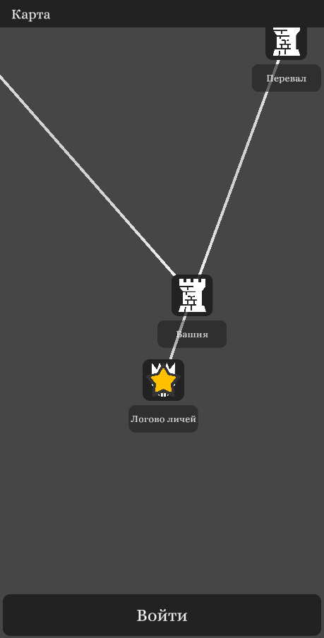
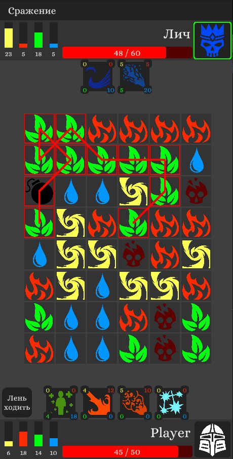
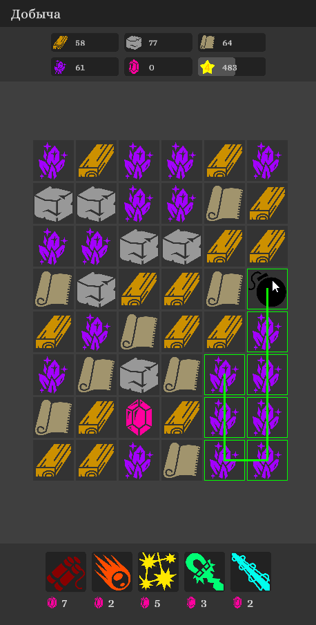

# PazzleProject

Игра в жанре "Три в ряд", но все не так просто, выберите более 2-ух элеметов для того что бы их сжечь. В игре есть два режима: Сражение и добыча. В сражении вам придется сражаться с противником, сжигайте черепа для нанесения противнику урона или используйте заклинания для нанесения урона, сжагания элеметов или лечения.

Стоит отметить что игра не доработана до конца, и в ней присутствуют некоторые известные проблемы.

# Gameplay

Видео геймплея.

Путешествуйте по карте посещая различные места!

Сражайтесь с противниками!

Добывайте ресурсы!

# Roadway

[+] Карта  
[+] Разные сущности 
[+] Система сражения 
[+] Анимация в сражении 
[-] Заклинания в зависимости от снаряжения. 
[-] Анимация в шахте 
[-] Города, инвентарь и т.д. 